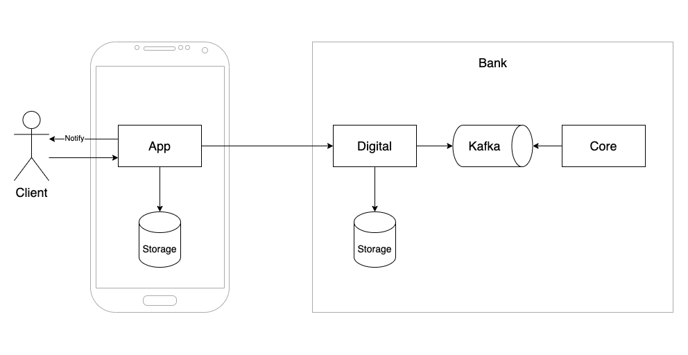
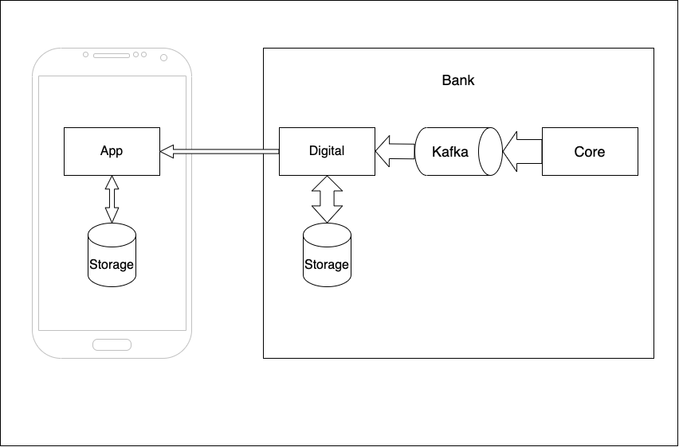
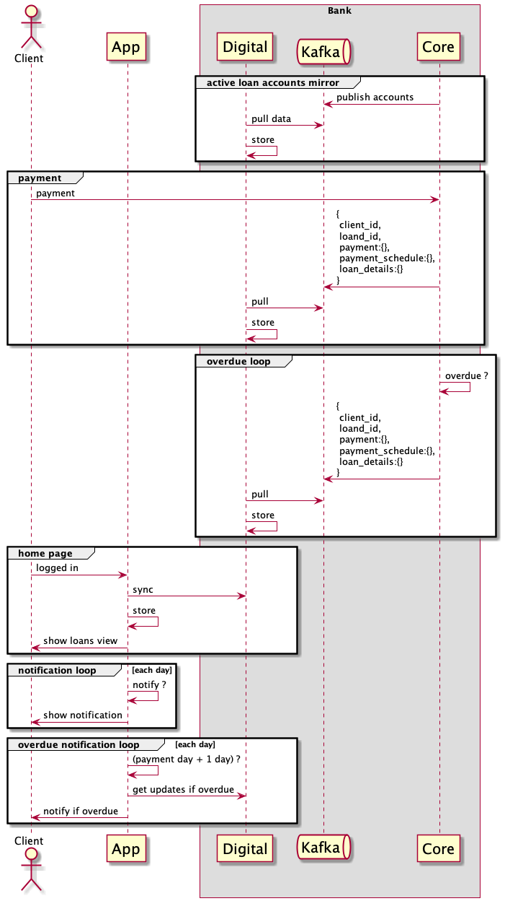
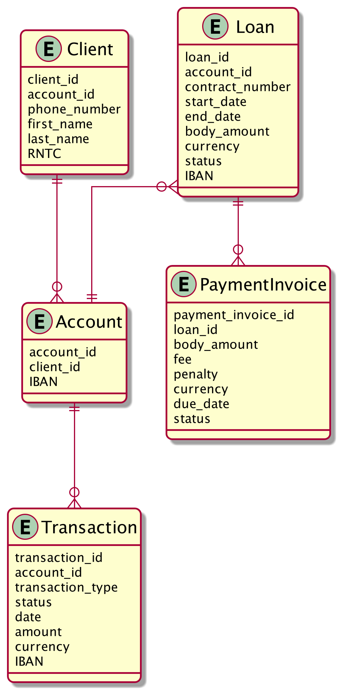

# Stereo Bank - Digital Service

## Business goal
- Digital service is a new normal for the bank industry, if you don't have it - you lose
- Be close to the clients and have solid communication channel
- Make it easier for clients to spend money

## Vision
- M1 - 6 month
    - Loan as a transparent service, not a fraud
    - Loan info in your pocket (24/7)
    - Payment reminder
- M2 - 3 month
    - Loan payments from mobile app
    - Reminder configuration

<br/>

CONTENTS
- [Summary](#summary)
- [Assumptions](#assumptions)
- [Capabilities](#capabilities)
- [Solution context](#solution)
- [Sequence](#sequence)
- [Digital ERD](#digital-erd)
- [Dictionary](#dictionary)


### Summary
```text
This project... For existing clients... Time to market... With budget... With the team...
```
### Assumptions
#### Market
- Target market: Stereo Bank clients in Ukraine with loan
- Max number of clients:  ~ 1mln
  ```text
   = 44mln x (from 18 to 50 age rate) x (people with loan rate) x (stereo bank market share)
   = 44 x 0.5 x 0.25 x 0.2
  ```
- Target audience:
  - age: 18-50
  - place of residence: whole country (cities, villages etc.)
  
#### Technical context
- Client:
  - device: android smartphone
  - internet connection: unstable
  - app storage: ~ Mb ? 
    ```text
    calculate
    ```
- Bank:  
  - digital/core communication: kafka
  - digital storage: ~ Gb ?  
    ```text
    calculate
    ```
  - existing IT capabilities (on-premise servers, cloud) ?

#### Bank
- Budget ?
- Resources ?
  
    


### Capabilities
- M1
  - mobile
    - login/registration
    - loan dashboard
    - loan details
    - payment reminder before 2 weeks, 1 week, 3 days, 1, 0
  - digital
    - authentication/authorization
    - real time data mirror from core system  
  - core
    - push client info: [phone number, RNTRC, email, client_bank_id] to kafka for registration 
    - push loan data updates to kafka in real time
- M2
  - mobile
    - cards list: [title, number, IBAN]
    - loan payment by click on the next scheduled payment
    - reminder configuration (days before)
  - digital
    - loan payment transaction
  - core
    - loan payment transaction kafka api

### Solution



### Data flow ?



### Sequence



## Digital ERD



## Dictionary